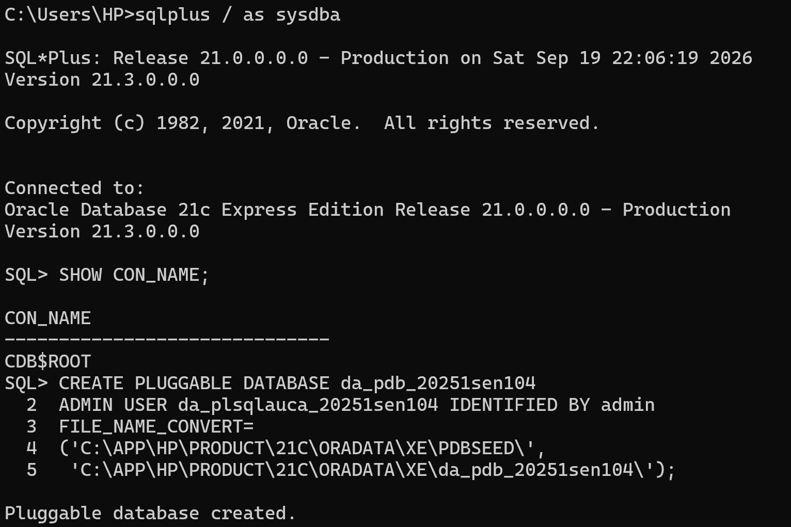
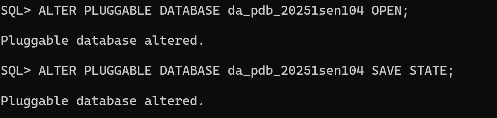
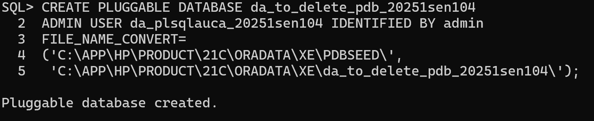
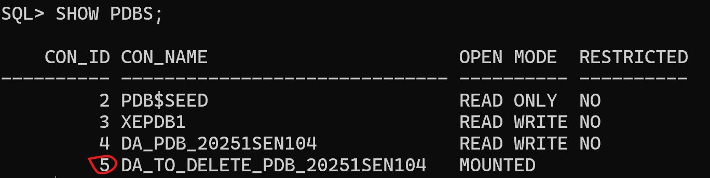
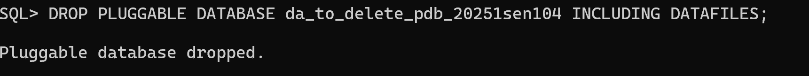
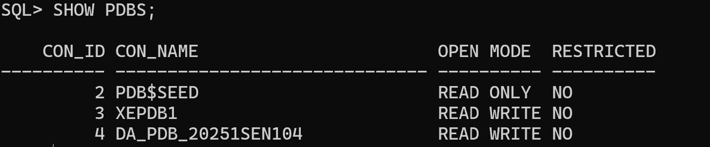
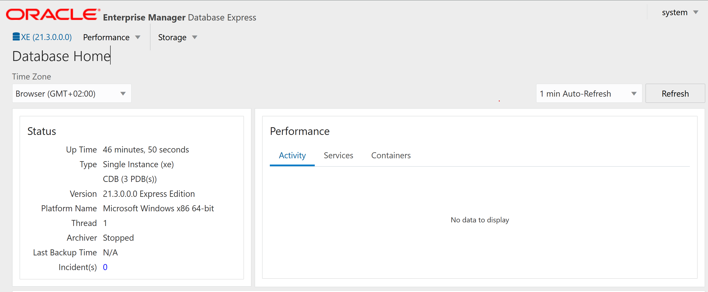
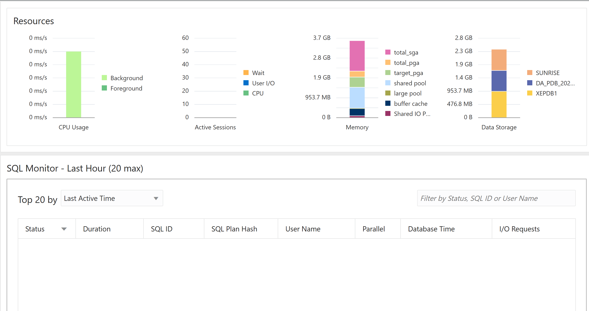

# Assignment II: Oracle PDB Management and OEM Setup

## Assignment Scope
This assignment covers multi-faceted aspects of Oracle 21c configuration, including:
* Creation and deletion of Pluggable Databases (PDBs)
* User creation and management inside a PDB
* Usage of Oracle Enterprise Manager (OEM)

## Task 1: Create a New Pluggable Database
**Steps**
* Log in to the Oracle database as sys admin user  
* Check the current CDB I am connected to using SHOW CON\_NAME;  
* Ideally, I will conventionally create the PDB inside CDB$ROOT and a local user connected to the PDB  

 

***Explanation of PDB creation***
```sql
-- create PDB
CREATE PLUGGABLE DATABASE da_pdb_20251sen104
-- create local user within PDB
ADMIN USER da_plsqlauca_20251sen104 IDENTIFIED BY admin
-- instruct Oracle where to store the pdb's data files
FILE_NAME_CONVERT=
('C:\APP\HP\PRODUCT\21C\ORADATA\XE\PDBSEED\',
 'C:\APP\HP\PRODUCT\21C\ORADATA\XE\da_pdb_20251sen104\');
```

* Then, I will open the PDB and save its state so that I can read and write to it.


## Task 2: Create and Delete a PDB

**Steps**

* Create the temporary PDB 



* Verify that the PDB exists



* Delete PDB completely



* Confirm it no longer exists



As you can see, PDB number 5 is gone.

## Task 3: Oracle Enterprise Manager (OEM) Setup

I configured Oracle Enterprise Manager using the pre-installed OEM Database Express web application available via https://localhost:5500/em and logged in as the system user. 



## Submission Details
* Repository Link: https://github.com/davidmunezero/oracle_pdb_ass_II_20251sen104_david.git
* PDB Name Created: da_pdb_20251sen104
* Issues Encountered: None
